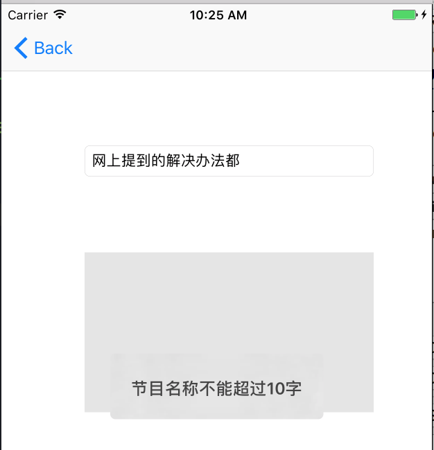

# 实现中文输入法下的字数限制

实现中文输入法下 UITextField/UITextView 的字数精确限制。但用户在 TextField/TextView 中输入的字数（中文或英文）超过限制时，多余的字符将被删除并根据你的需求给与用好提示：



## 用法

将 UITextField+TextChange.h/.m、UITextView+TextChange.h/.m、ZhCharNumberLimit.h/.m 拷贝到你的项目中，并在源代码中导入对应的头文件。

让 ViewController 声明继承 ZhCharNumberLimitDelegate 协议：

	@interface ViewController ()<ZhCharNumberLimitDelegate>
 
然后在 ViewController 的 viewDidLoad  方法中，构造一个 ZhCharNumberLimit 对象，然后将它赋给 TextView/TextField 的 textChangeDelegate 属性：

```swift

	ZhCharNumberLimit* limit = [[ZhCharNumberLimit alloc]initWithDelegate:self charLimited:10];
    
    _textView.textChangeDelegate = limit;
    
    _textField.textChangeDelegate = limit;
```

实现协议方法 exceedLimit: ，这个方法当 TextField/TextView 中输入的字数超过限制时调用，你可以在这里提示一些信息：

```swift
-(void)exceedLimit:(int)charLimited{
    NSString * string = [NSString stringWithFormat:@"节目名称不能超过%d字",charLimited];
    [MBProgressHUD showError:string toView:self.view];
}
```

## Demo

Demo 使用了 Cocoapods 管理依赖。请用 xcworkspace 文件而不是 xcodeproj 文件打开项目。本项目使用了 MBProgressHud 和 MLeakFinder(用于检查内存泄漏)。